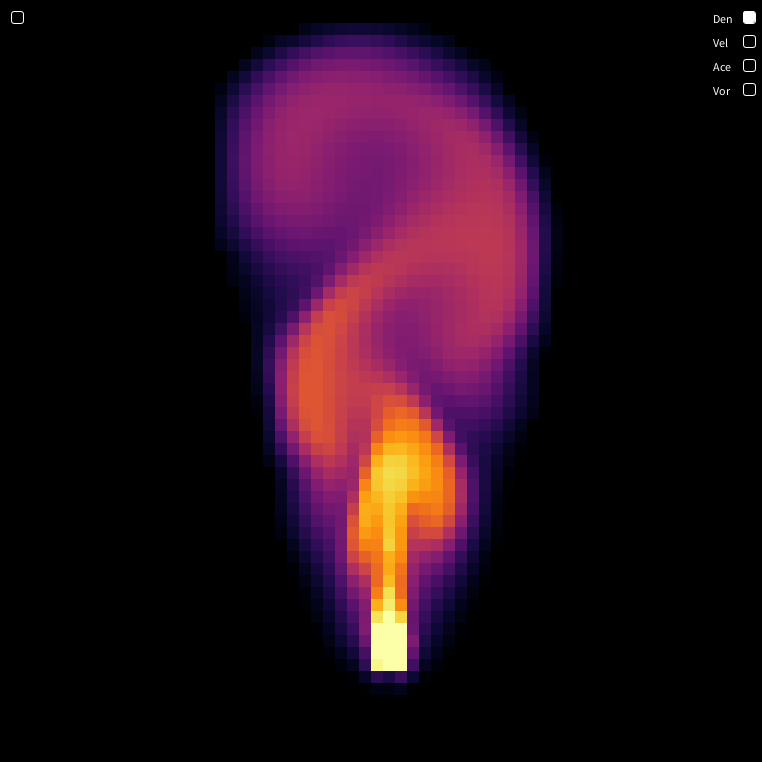
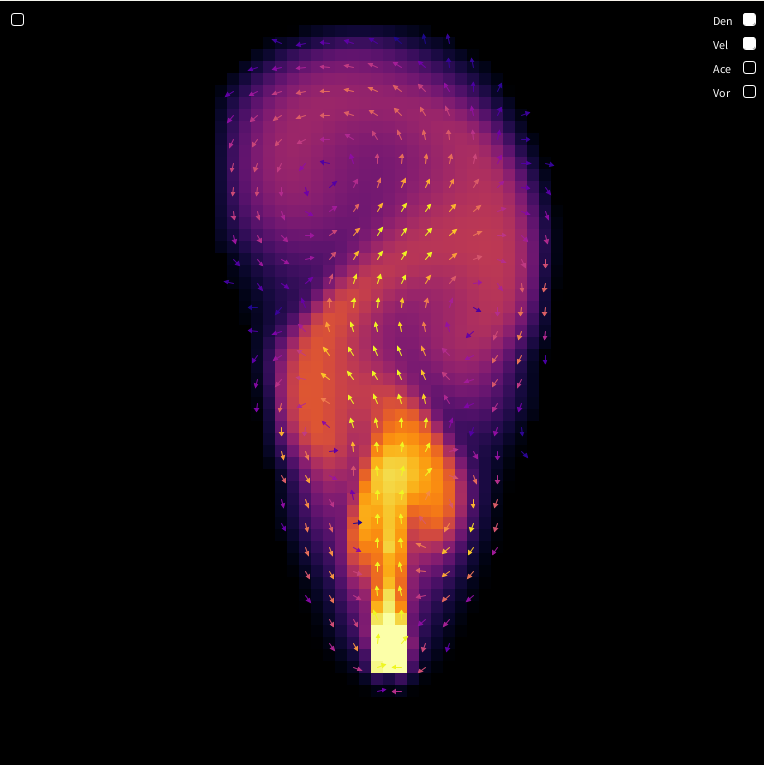
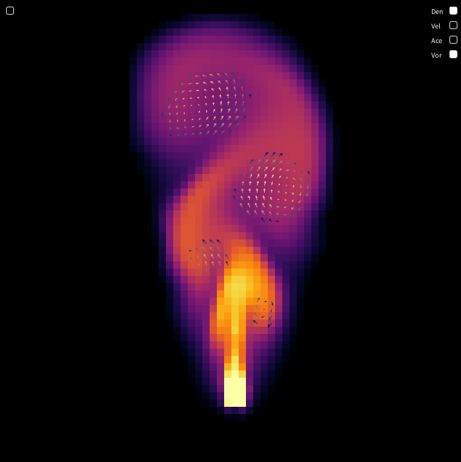

# Simulación de fluidos interactiva implementado en processing

Proyecto de simulación de fluidos en Processing basado en el artículo *Real-Time Fluid Dynamics for Games* de Jos Stam y el video de **The Coding Train - Coding Challenge 132: Fluid Simulation**.  

Esta versión añade funcionalidades adicionales:  

- Pausa de la simulación  
- Renderizado del **campo de aceleración**  
- Renderizado del **campo de velocidad**  
- Detección de **vórtices**  
- Botones interactivos para seleccionar qué se quiere visualizar  

## Capturas de la simulación

### Simulación de densidad

### Campo de aceleración

### Campo de velocidad

### Detección de vórtices

## Cómo usar

1. Abre el proyecto en Processing.  
2. Ejecuta `Main-FluidSimulation.pde`.  
3. Usa los botones en pantalla para seleccionar qué visualizar.  
4. Pausa la simulación cuando quieras inspeccionar el estado del fluido.

## Referencias

- Jos Stam, *Real-Time Fluid Dynamics for Games*, 2003.  
- The Coding Train, *Coding Challenge 132: Fluid Simulation*, [Video](https://www.youtube.com/watch?v=alhpH6ECFvQ).

